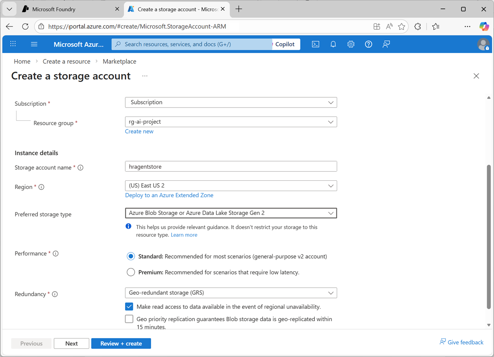
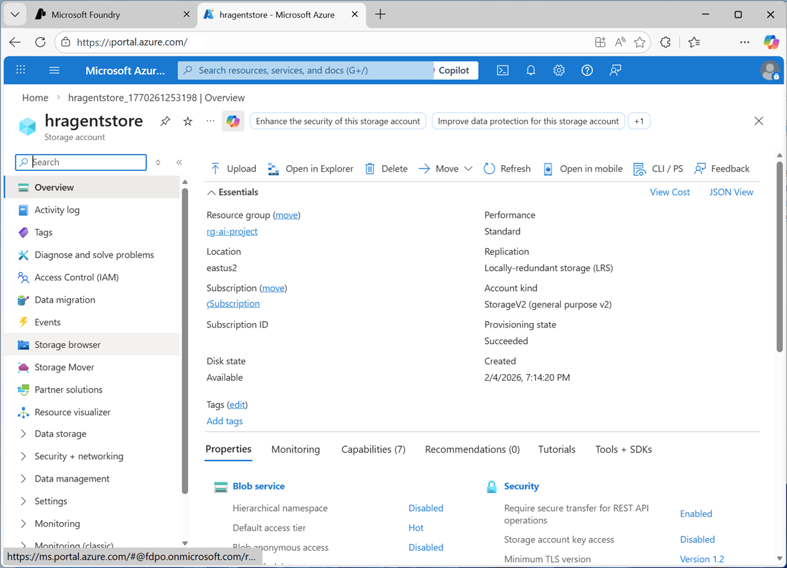
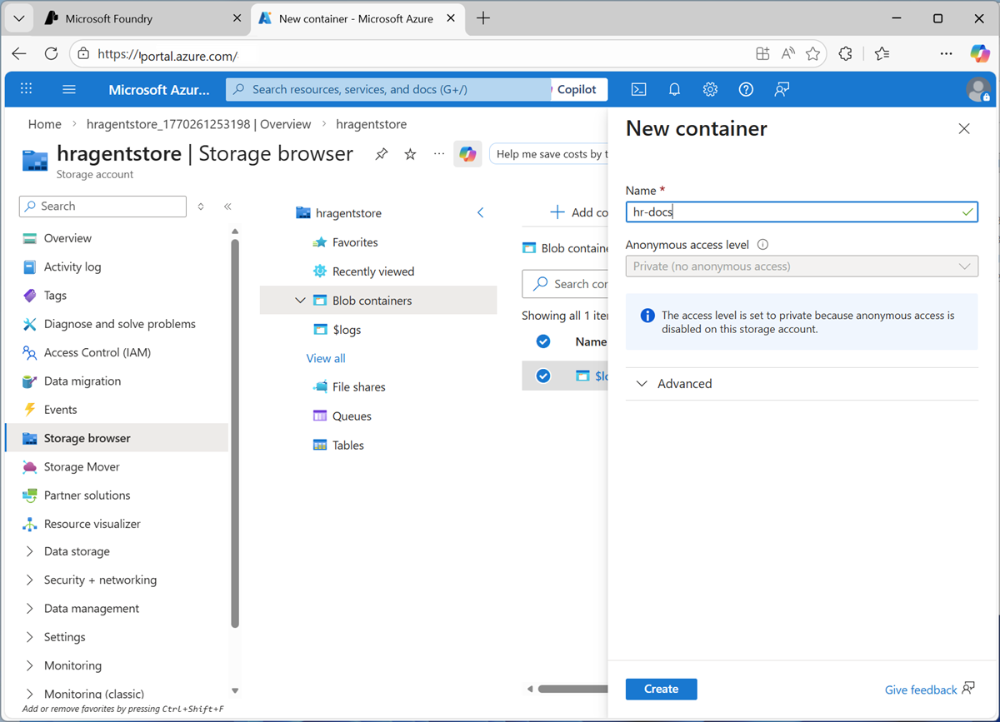
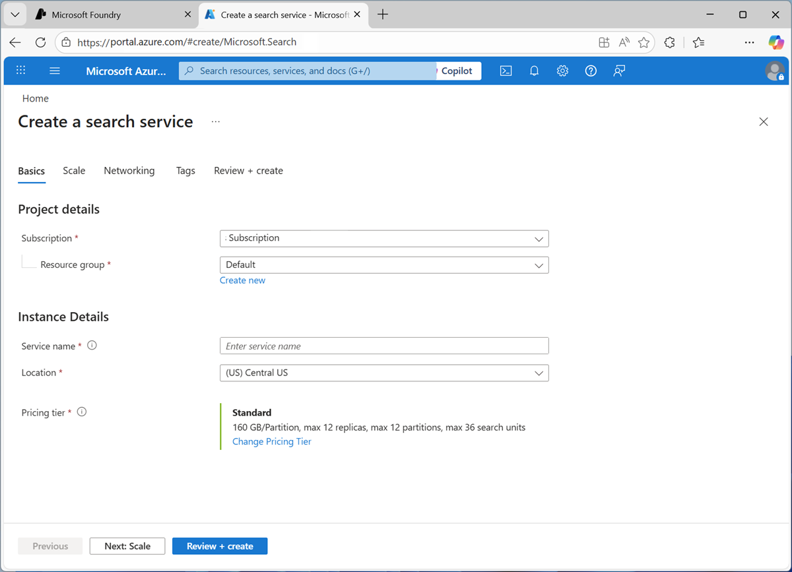
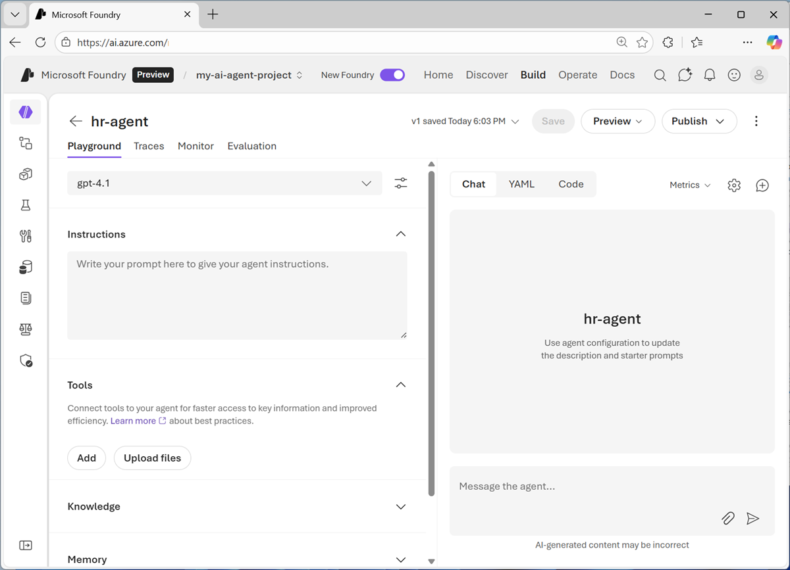
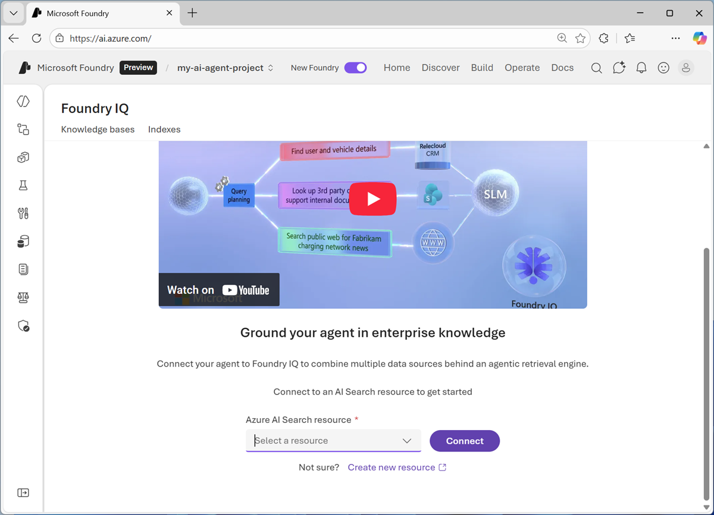
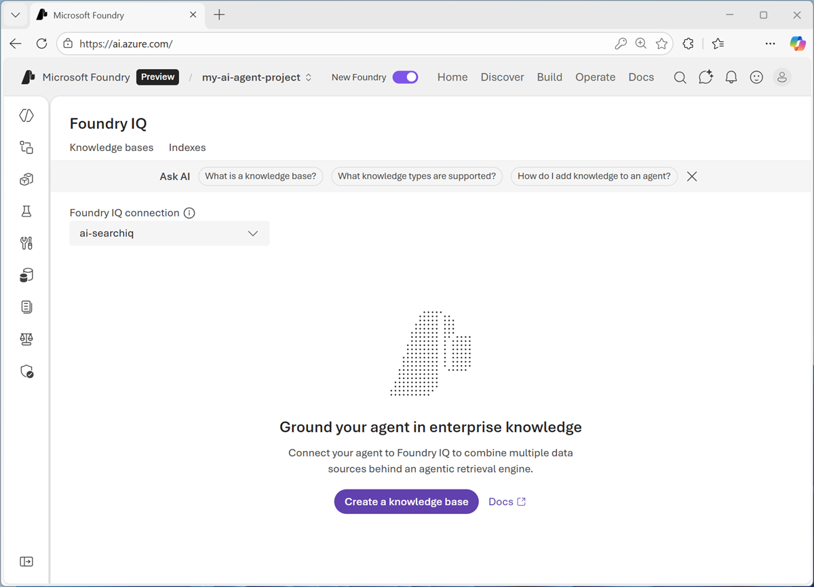
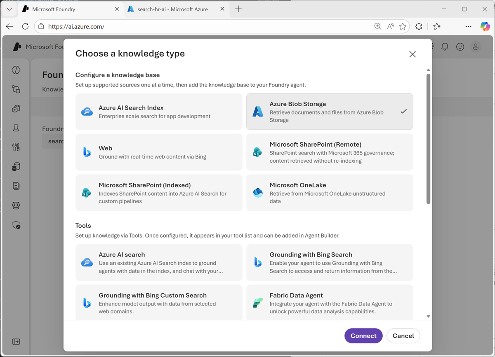
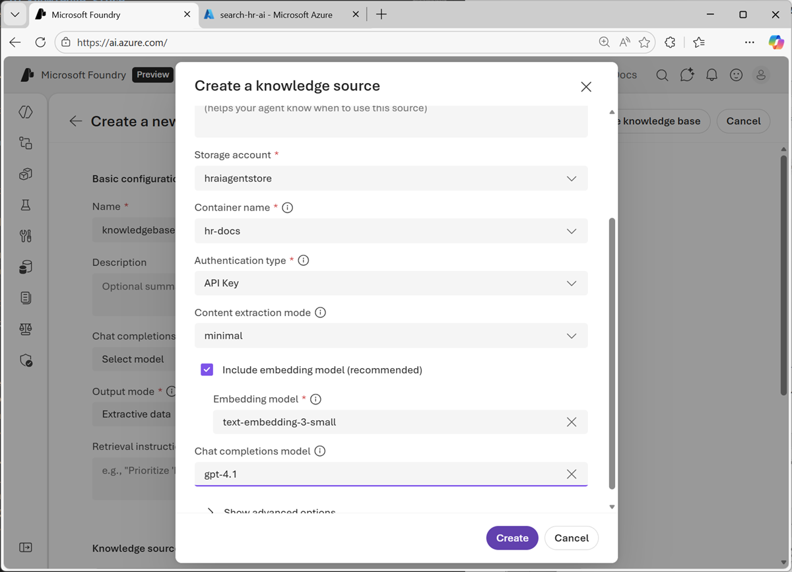

---
lab:
    title: 'Get started with Foundry IQ in Microsoft Foundry'
    description: 'Use Foundry IQ to connect an agent to knowledge.'
---

# Get started with Foundry IQ in Microsoft Foundry

The HR department at Contoso Corp wants to reduce employee support effort and empower employees by providing a self-service solution for queries about HR polices and procedures.

In this exercise, you'll use Microsoft Microsoft Foundry IQ to create an AI agent that uses knowledge contained in HR documentation to advise employees on HR-related issues.

This exercise should take approximately **20** minutes to complete.

> **Note** > To complete this exercise, you need credentials for an Azure subscription in which you have sufficient permissions to create the required  resources.

## Create a storage account for HR data

Let's start by storing the HR documentation in an Azure storage account. To keep things simple, we'll use a single employee handbook document in this exercise. This obviously does not represent a real-world volume of data; but will serve to illustrate the principle.

1. Download [employee_handbook.pdf](https://microsoftlearning.github.io/mslearn-ai-fundamentals/data/employee_handbook.pdf) and save it in any folder on your computer.
1. In a web browser, open the [Azure portal](https://portal.azure.com){:target="_blank"} at `https://portal.azure.com`. If prompted, sign in using your Azure credentials.
1. Select **+ Create a resource**, and search for `Storage account`. Then create a new storage account with the following configuration:
    - **Subscription**: *Your Azure subscription*
    - **Resource group**: *Create a new resource group, or select an existing one*
    - **Storage account name**: *A unique name for your storage account*
    - **Region**: *Select any available region*
    - **Preferred storage type**: Azure Blob Storage or Azure Data Lake Storage Gen 2
    - **Performance**: Standard
    - **Redundancy**: Locally-redundant storage (LRS)

    

1. Wait for your storage account to be created, and then go to the newly created resource.
1. In the pages pane (on the left) for your storage account, select **Storage browser**.

    

1. In the storage browser, select **Blob containers** and then create a new container with a **private** access level for your HR documentation.

    

1. When the new container is created, upload the **employee_handbook.pdf** document you downloaded previously to it.

## Create an Azure AI Search resource

To make the employee handbook searchable, we'll use Azure AI Search to create an index.

1. In the Azure portal, on the **Home** page, select **+ Create a resource**, and search for `Azure AI Search`. Then create a new Azure AI Search resource with the following configuration:

1. Create a new AI search resource with the following configuration:

    - **Subscription**: *Your Azure subscription*
    - **Resource group**: *Select the resource group containing your storage account*
    - **Service name**: *A unique name for your search resource*
    - **Location**: *The same region as your storage account*
    - **Pricing tier**: *Change the default pricing tier to* Free *(if you have already used to quota for free Azure AI Search resources, select* Basic *)*

    

## Create an AI agent

Now that you have the necessary infrastructure in place, you're ready to create an AI agent that can search the HR documentation for answers to employee questions.

1. In your web browser, open [Microsoft Foundry](https://ai.azure.com){:target="_blank"} at `https://ai.azure.com` and sign in using your Azure credentials. Close any tips or quick start panes that are opened the first time you sign in, and if necessary use the **Foundry** logo at the top left to navigate to the home page.
1. If it is not already enabled, in the tool bar the top of the page, enable the **New Foundry** option. Then, if prompted, create a new project with a unique name of your choice, using the default options. After creating or selecting a project in the new Foundry portal, it should open in a page similar to the following image:

    
.

1. In the **Start building** menu, select **Create agent**; and when prompted, name the agent **hr-Agent**.

     When ready, your agent opens in the agent playground.

    

1. In the model drop-down list, ensure that a **gpt-41** model has been deployed and selected for your agent.
1. Assign your agent the following **Instructions**:

    ```
   You are an AI agent in the HR department of Contoso Corp. You answer employee questions about HR policies and processes. Always respond politely and professionally. Do not engage in conversations beyond the subject of HR policies and processes.
    ```

1. Use the **Save** button to save the changes.
1. Test the agent by entering the following prompt in the **Chat** pane:

    ```
   What can you help me with?
    ```

    The agent should respond with an appropriate answer based on its instructions.

1. Try this prompt:

    ```
   What is the capital of France?
    ```

    The agent should not engage in a conversation about European capitals! It should redirect the topic to HR policies and procedures.

1. Now try this:

    ```
   What's the process for taking vacation?
    ```

    The agent may respond with what *seems* like a correct answer. However, the agent currently has no knowledge of Contoso's HR policies and procedures; so the answer is not grounded in accurate information.

    Let's fix that!

## Add a Foundry IQ knowledge base

Foundry IQ is a central connection point for data sources that agents can use as knowledge bases. It enables you to create and manage a collection of knowledge that multiple agents can use, without the need to code data access and query logic in each agent.

1. In the pane on the left of the playground, expand **Knowledge**. Then in the **Add** list, select **Connect to Foundry IQ**.

    You should be prompted to connect to a search resource:

    

1. Select **Connect to an AI Search resource** to open the Foundry IQ page.

    

1. In the **Foundry IQ** page, in the list of available AI Search resources, select **Create a new resource**.


1. When you have created the AI Search resource, return to the browser tab containing the Foundry portal and connect to it using **API key** authentication.

    Now you're ready to create a knowledge base.

    

1. Select **Create a knowledge base**, and then select **Azure blob store** and **connect**.

    

1. When prompted, create a knowledge store based on the blob container you created in your storage account (to which you uploaded the employee handbook). Include a text-embedding model and set the model used by your agent as the chat completions model. 

    

1. After adding the knowledge source, complete the configuration of the knowledge base by assigning it a name, selecting the model used by your agent as the **Chat completions model**, and setting the **Output mode** to *Extractive data*. The save your knowledge base.

    

1. When you've saved the knowledge store, in the **use in an agent** drop-down list, select your HR agent.

## Test the knowledge base

Now you're ready to test your agent's knowledge of HR policies and procedures!

1. In the chat pane, enter the following query:

    ```
   What's the process for taking vacation?
    ```


## Summary

In this exercise, you explored how to deploy an chat with a generative AI model in Microsoft Foundry portal. You then saved the model as an agent, and configured the agent with instructions and tools before exploring options for deploying and using the agent.

The agent explored in this exercise is a simple example that demonstrates how quickly and easily you can get started with generative AI app and agent development using Microsoft Foundry. From this foundation, you could build a comprehensive agentic solution in which agents use tools to find information and automate tasks, and collaborate with one another to perform complex workflows.

## Clean Up

If you have finished exploring Microsoft Foundry, you should delete the resources created in this exercises to avoid unnecessary utilization charges.

1. Open the [Azure portal](https://portal.azure.com){:target="_blank"} at `https://portal.azure.com` and view the contents of the resource group where you deployed the project used in this exercise.
1. On the toolbar, select **Delete resource group**.
1. Enter the resource group name and confirm that you want to delete it.